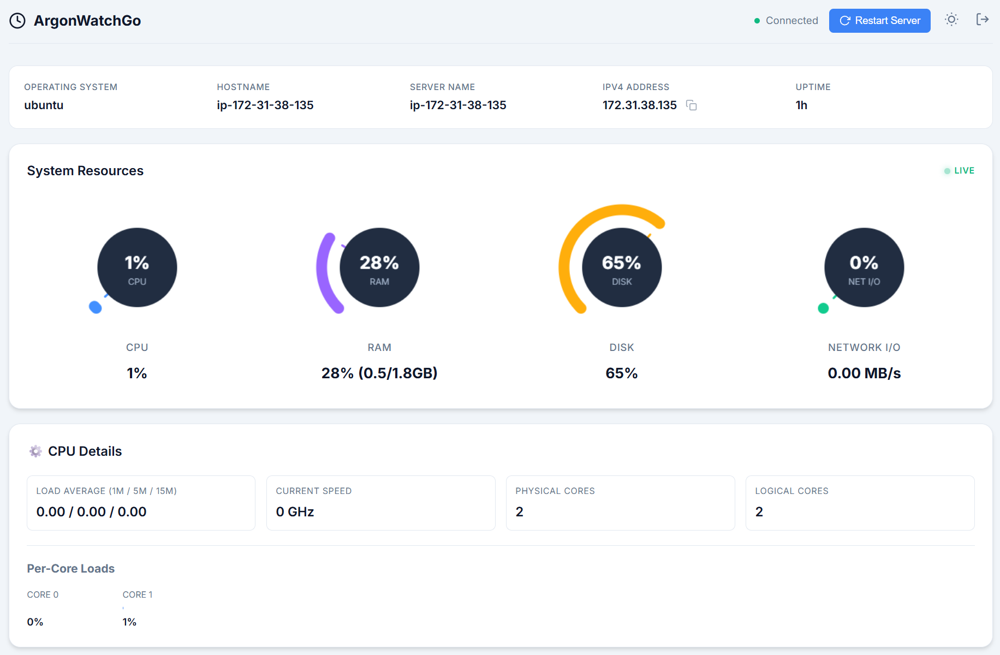
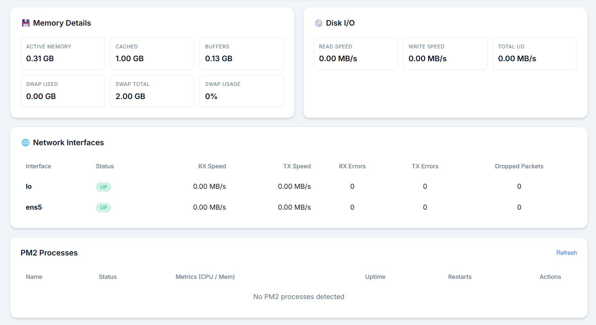
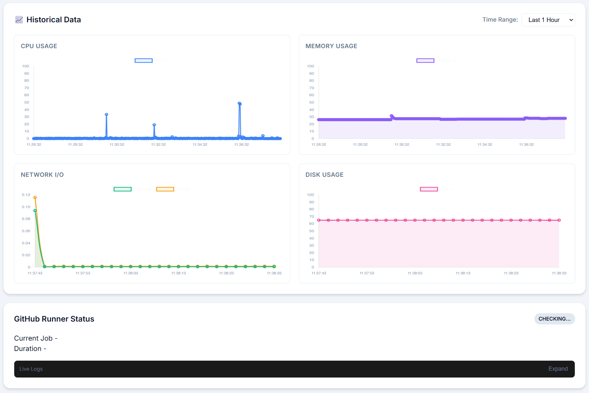

# ArgonWatchGo - Server Monitor

A lightweight, self-hostable server monitoring tool with comprehensive metrics and minimal resource usage.

<p align="center">
  
  
  
</p>

## Features

### ✅ **Enhanced System Resource Monitoring**
- **Real-time CPU monitoring** with per-core loads and load averages (1m, 5m, 15m)
- **Detailed memory metrics** including active, cached, buffers, and swap usage
- **Disk I/O performance** tracking with read/write speeds (MB/s)
- **Network interface monitoring** with bandwidth, errors, and packet loss tracking
- **Live charts and visualizations** with color-coded status indicators
- **Historical data storage** (7 days retention) for trend analysis

### 🌡️ **Hardware Health Monitoring**
- **Temperature sensors** for CPU, GPU, and disk drives
- **SMART disk health** status and failure prediction
- **GPU metrics** including utilization, VRAM usage, and fan speeds
- **Fan speed monitoring** for cooling system health
- **Color-coded warnings** (Green < 60°C, Yellow < 80°C, Red > 80°C)

### ⚙️ **Detailed CPU Insights**
- **Per-core CPU loads** with individual utilization bars
- **Current CPU frequency** monitoring across all cores
- **Load averages** for system load trend analysis
- **Physical and logical core** count display

### 💾 **Advanced Memory Analytics**
- **Active memory** usage tracking
- **Cache and buffer** memory breakdown
- **Swap memory** utilization and percentage
- **Real-time memory** allocation visualization

### 💿 **Disk Performance & Health**
- **Real-time I/O speeds** (read/write MB/s)
- **SMART health status** for early failure detection
- **Disk temperature** monitoring per drive
- **Usage percentage** across all partitions

### 🌐 **Network Interface Details**
- **Per-interface statistics** (RX/TX speeds)
- **Error counters** (RX errors, TX errors)
- **Dropped packet** tracking
- **Interface status** monitoring (up/down)

### 📊 **PM2 Process Management**
- View all PM2 processes in a table
- Monitor status, uptime, restarts, CPU, and memory

### ⚡ **Service & Database Monitoring**
- **Services**: HTTP, TCP, Ping, and Process checks
- **Databases**: Comprehensive monitoring for **MongoDB**, **MySQL**, **PostgreSQL**, and **Redis** (connections, ops/sec, memory, cache hits, etc.). See [Database Monitoring Docs](docs/DATABASE_MONITORING.md).

### 🔐 **Authentication & Security**
- **Login panel** with username/password authentication
- **Two-Factor Authentication (2FA)** using TOTP (compatible with Google Authenticator, Authy, etc.)
- **JWT-based session management** with configurable expiration
- **Protected routes** requiring authentication
- **Initial setup wizard** for admin account creation

---

## 🚀 To-Do / Roadmap

- [x] **Resource monitoring** - CPU, Memory, Disk, and Network tracking
- [x] **PM2 monitoring** - Process management and stats
- [ ] **Github runner monitoring** - Track status of self-hosted runners
- [x] **MongoDB monitoring** - Connection and perf metrics
- [x] **PostgreSQL monitoring** - Query performance and health
- [ ] **Browser command line access** - Secure terminal in the browser
- [ ] **Backup monitoring** - Status of automated backups
- [ ] **Docker monitoring** - Container health and resource usage
- [ ] **SSL Expiry tracking** - Monitor certificate expiration dates
- [ ] **Notification system** - Discord/Slack/Telegram webhooks


## Installation

### Prerequisites
- None! (The binary contains everything)
- (Optional) PM2 for process monitoring

---

## Linux Installation

### Quick Install (Recommended)

One-command installation with automatic systemd service setup:

```bash
curl -sSL https://raw.githubusercontent.com/uvesarshad/ArgonWatchGo/main/scripts/install-linux.sh | sudo bash
```

The installer will:
- Download the latest binary
- Create a systemd service
- Enable auto-start on boot
- Create a default configuration automatically
- Generate a JWT secret automatically
- Start the service

After installation:
- Visit `http://YOUR_SERVER_IP:3000`
- If you are using a reverse proxy, visit your domain instead
- Complete the initial setup wizard to create your admin account
- Start monitoring immediately

You do not need to manually create `config.json` for the first launch. Use the [Configuration](#configuration) section later if you want to customize ports, services, databases, alerts, or authentication settings.

### Manual Installation

#### 1. Download the Binary
```bash
# Download latest release
wget https://github.com/uvesarshad/ArgonWatchGo/releases/latest/download/argon-watch-go-linux
chmod +x argon-watch-go-linux
sudo mv argon-watch-go-linux /usr/local/bin/argon-watch-go
```

#### 2. Create Configuration Directory
```bash
sudo mkdir -p /etc/argon-watch-go
sudo mkdir -p /var/lib/argon-watch-go/data
```

#### 3. Create Configuration File
```bash
sudo nano /etc/argon-watch-go/config.json
```
(See Configuration section below)

#### 4. Create Systemd Service
```bash
sudo nano /etc/systemd/system/argon-watch-go.service
```

Add the following content:
```ini
[Unit]
Description=ArgonWatchGo Server Monitor
After=network.target

[Service]
Type=simple
User=root
WorkingDirectory=/etc/argon-watch-go
ExecStart=/usr/local/bin/argon-watch-go
Restart=always
RestartSec=10

[Install]
WantedBy=multi-user.target
```

#### 5. Enable and Start Service
```bash
sudo systemctl daemon-reload
sudo systemctl enable argon-watch-go
sudo systemctl start argon-watch-go
```

#### 6. Check Status
```bash
sudo systemctl status argon-watch-go
```

#### 7. View Logs
```bash
sudo journalctl -u argon-watch-go -f
```

After manual installation:
- Open `http://YOUR_SERVER_IP:3000`
- First-time users will be redirected to `/setup`
- Create your admin account
- Optionally enable 2FA by scanning the QR code with your authenticator app

### Uninstallation

To completely remove ArgonWatchGo from your Linux server:

**One-Command Uninstall:**
```bash
curl -sSL https://raw.githubusercontent.com/uvesarshad/ArgonWatchGo/main/scripts/uninstall-linux.sh | sudo bash
```

**Manual Uninstall:**
```bash
# Stop and disable service
sudo systemctl stop argon-watch-go
sudo systemctl disable argon-watch-go

# Remove service file
sudo rm /etc/systemd/system/argon-watch-go.service
sudo systemctl daemon-reload

# Remove binary
sudo rm /usr/local/bin/argon-watch-go

# Remove configuration and data
sudo rm -rf /etc/argon-watch-go
sudo rm -rf /var/lib/argon-watch-go
```

---

## Windows Installation

### 1. Download the Binary
Download the latest `argon-watch-go.exe` from the releases page.

### 2. Create Configuration
Create a `config.json` file in the same directory as the executable (see Configuration section below).

### 3. Run the Application
```powershell
# Run directly
.\argon-watch-go.exe

# Or run in background with PowerShell
Start-Process -NoNewWindow -FilePath ".\argon-watch-go.exe"
```

### 4. Access the Dashboard
Open your browser and navigate to `http://localhost:3000`

### 5. Complete Initial Setup
- First-time users will be redirected to `/setup`
- Create your admin account
- Optionally enable 2FA by scanning the QR code with your authenticator app
- Login and start monitoring!

### Running as Windows Service (Optional)
To run ArgonWatchGo as a Windows service, you can use [NSSM (Non-Sucking Service Manager)](https://nssm.cc/):

```powershell
# Download NSSM and install the service
nssm install ArgonWatchGo "C:\path\to\argon-watch-go.exe"
nssm set ArgonWatchGo AppDirectory "C:\path\to"
nssm start ArgonWatchGo
```

---

## Build from Source

1. **Install Go 1.21+**

2. **Clone the repository**

3. **Build:**
   ```bash
   cd backend
   go mod tidy
   go build -o argon-watch-go ./cmd/server
   ```

---

## Configuration

Create a `config.json` file:

```json
{
  "server": {
    "port": 3000,
    "host": "0.0.0.0"
  },
  "monitoring": {
    "systemInterval": 2000,
    "servicesInterval": 30000
  },
  "storage": {
    "enabled": true,
    "retentionDays": 7,
    "dataPath": "./data"
  },
  "auth": {
    "enabled": true,
    "jwtSecret": "CHANGE-THIS-TO-A-SECURE-RANDOM-SECRET-KEY",
    "tokenExpiration": 24,
    "usersFile": "./data/users.json"
  },
  "services": [
    {
       "name": "My Website",
       "type": "http",
       "url": "https://example.com"
    }
  ],
  "databases": [
    {
       "name": "Main DB",
       "type": "postgres",
       "host": "localhost",
       "port": 5432,
       "user": "postgres",
       "password": "password",
       "database": "mydb"
    }
  ],
  "alerts": {
      "enabled": true,
      "rules": [
          {
              "id": "cpu-high",
              "metric": "cpu.load",
              "condition": ">",
              "threshold": 90,
              "notifications": ["desktop"]
          }
      ]
  }
}
```

### Database Configuration

Use the `databases` array in `config.json` to enable database monitoring. If `databases` is empty, no database panel will appear on the dashboard.

Example:

```json
{
  "databases": [
    {
      "id": "main-postgres",
      "name": "Main PostgreSQL",
      "type": "postgres",
      "host": "127.0.0.1",
      "port": 5432,
      "user": "postgres",
      "password": "your-password",
      "database": "app"
    },
    {
      "id": "main-mongo",
      "name": "Main MongoDB",
      "type": "mongodb",
      "host": "127.0.0.1",
      "port": 27017,
      "user": "admin",
      "password": "your-password",
      "database": "admin"
    },
    {
      "id": "cache",
      "name": "Redis Cache",
      "type": "redis",
      "host": "127.0.0.1",
      "port": 6379,
      "password": "your-password",
      "database": 0
    }
  ]
}
```

Notes:
- Use `user` for the database username
- Use `postgres` for PostgreSQL
- `postgresql` and `username` are still accepted for backward compatibility
- Redis `database` values can be numeric
- See [Database Monitoring Docs](docs/DATABASE_MONITORING.md) for more examples and metric details

### Authentication Configuration

- **enabled**: Enable/disable authentication (default: true)
- **jwtSecret**: Secret key for JWT signing (MUST be changed in production!)
- **tokenExpiration**: JWT token expiration in hours (default: 24)
- **usersFile**: Path to users database file (default: ./data/users.json)

**Important**: Change the `jwtSecret` to a secure random string before deploying to production!

---

## Reverse Proxy Setup

For production deployments, it's recommended to run ArgonWatchGo behind a reverse proxy with SSL/TLS.

### Nginx

```nginx
server {
    listen 80;
    server_name monitor.example.com;
    return 301 https://$server_name$request_uri;
}

server {
    listen 443 ssl http2;
    server_name monitor.example.com;

    ssl_certificate /path/to/cert.pem;
    ssl_certificate_key /path/to/key.pem;

    location / {
        proxy_pass http://localhost:3000;
        proxy_http_version 1.1;
        proxy_set_header Upgrade $http_upgrade;
        proxy_set_header Connection 'upgrade';
        proxy_set_header Host $host;
        proxy_set_header X-Real-IP $remote_addr;
        proxy_set_header X-Forwarded-For $proxy_add_x_forwarded_for;
        proxy_set_header X-Forwarded-Proto $scheme;
        proxy_cache_bypass $http_upgrade;
    }

    # WebSocket support
    location /ws {
        proxy_pass http://localhost:3000;
        proxy_http_version 1.1;
        proxy_set_header Upgrade $http_upgrade;
        proxy_set_header Connection "upgrade";
        proxy_set_header Host $host;
        proxy_set_header X-Real-IP $remote_addr;
        proxy_read_timeout 86400;
    }
}
```

### Caddy (Automatic HTTPS)

```caddy
monitor.example.com {
    reverse_proxy localhost:3000
}
```

Caddy automatically handles SSL/TLS certificates via Let's Encrypt!

### Apache

```apache
<VirtualHost *:80>
    ServerName monitor.example.com
    Redirect permanent / https://monitor.example.com/
</VirtualHost>

<VirtualHost *:443>
    ServerName monitor.example.com

    SSLEngine on
    SSLCertificateFile /path/to/cert.pem
    SSLCertificateKeyFile /path/to/key.pem

    ProxyPreserveHost On
    ProxyPass / http://localhost:3000/
    ProxyPassReverse / http://localhost:3000/

    # WebSocket support
    RewriteEngine On
    RewriteCond %{HTTP:Upgrade} =websocket [NC]
    RewriteRule /(.*)           ws://localhost:3000/$1 [P,L]
</VirtualHost>
```

Make sure to enable required modules:
```bash
sudo a2enmod proxy proxy_http proxy_wstunnel rewrite ssl
sudo systemctl restart apache2
```

---

## Resource Usage

- **Memory**: ~10-15MB RAM
- **CPU**: <1% average load
- **Disk**: Minimal (append-only logs)

---

## Security Best Practices

1. **Change the JWT secret** in `config.json` to a secure random string
2. **Enable 2FA** for all admin accounts
3. **Use HTTPS** in production (reverse proxy with SSL/TLS)
4. **Restrict access** using firewall rules if not using authentication
5. **Keep the binary updated** to the latest version
6. **Use strong passwords** (minimum 12 characters with mixed case, numbers, and symbols)

---

## License

MIT
